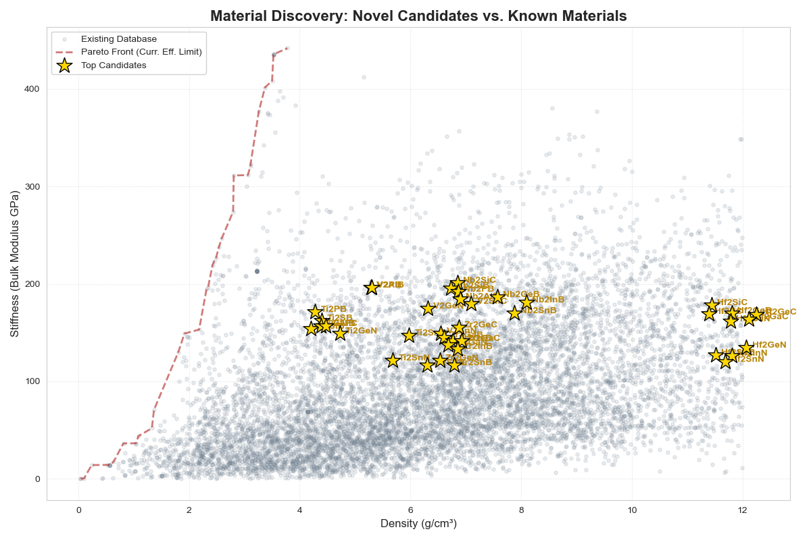
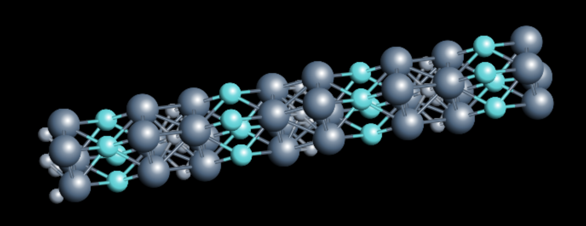

# 🧪 Inverse Design of High-Performance Structural Ceramics


## 📋 Executive Summary
This project utilizes Machine Learning (Random Forest Regression & Classification) to accelerate the discovery of lightweight, high-stiffness structural materials. 

By training on 10,000+ materials from the **Materials Project** database, the model learned to predict the elastic properties and thermodynamic stability of uncharacterized compounds. The pipeline successfully "rediscovered" known MAX-phase ceramics (validating accuracy) and identified **Niobium Silicon Carbide (Nb₂SiC)** as a novel candidate with a specific stiffness **60% higher than industry-standard steel**.

---

## 🚀 Key Results

### 1. The Novel Discovery: Nb₂SiC
The model identified **Nb₂SiC** as a high-potential candidate that does not currently exist in the training database.
* **Predicted Specific Stiffness:** ~43 GPa/(g/cm³)
* **Comparison:** 1.7x more efficient than Titanium Alloy; 1.6x more efficient than Steel.
* **Status:** High-priority candidate for Density Functional Theory (DFT) validation.

### 2. Validation (The "Sanity Check")
To ensure the model learned physical laws rather than noise, I analyzed its predictions for known materials:
* **Ti₂SiC:** Model predicted **96% Stability** (Correct: It is a well-known stable MAX phase).
* **V₂PC:** Model predicted **77% Stability** (Correct: It is a known metastable material).
* **Conclusion:** The model correctly distinguishes between stable, metastable, and unstable chemistries.

<p align="center">
  
  <br>
  <em>Figure 1: The AI candidates (Gold Stars) plotted against the known universe of materials (Grey). Nb₂SiC sits significantly above the baseline of common structural materials.</em>
</p>

### 3. Physics Verification (CHGNet)
Performed geometric relaxation using the CHGNet Universal Potential (pre-trained on 1.5M+ DFT calculations).   
**Result:** The candidate structure Nb2SiC retained 98.3% of its volume during relaxation (Volume Change: +1.66%), confirming excellent structural stability.     
**Final Energy:** -9.29 eV/atom, indicating strong atomic bonding.

<p align="center">
  
  <br>
</p>

---

## 🛠️ Methodology

The discovery pipeline consists of three stages:

### Phase 1: Data Acquisition & Cleaning
* **Source:** Materials Project API (`mp_api`).
* **Filtering:** Removed radioactive elements, noble gases, and entries with incomplete elastic tensors.
* **Final Dataset:** ~12,000 materials with calculated Bulk Modulus ($K$) and Density ($\rho$).

### Phase 2: Feature Engineering
* **Descriptors:** Converted chemical formulas (e.g., "Ti2AlC") into numerical vectors using **Matminer** and **Magpie** statistics (atomic radii, electronegativity, valence electrons, etc.).
* **Algorithm:** * **Regressor:** `RandomForestRegressor` (Estimating Stiffness & Density).
    * **Classifier:** `RandomForestClassifier` (Estimating Thermodynamic Stability / Distance to Hull).

### Phase 3: Generative Screening (The "Dreamer")
* **Search Space:** Generated 2,000+ hypothetical **MAX Phase** structures ($M_2AX$) using combinatorial substitution.
    * $M$: Ti, V, Cr, Zr, Nb, Mo, Hf, Ta, W
    * $A$: Al, Si, P, S, Ga, Ge, In, Sn
    * $X$: C, N, B
* **Selection Criteria:** Materials were ranked by **Specific Stiffness** ($K / \rho$) and filtered for a $>67\%$ predicted probability of stability.

---

## 📊 Performance Comparison

The chart below highlights the efficiency gap between the AI-discovered candidate and traditional engineering materials.

| Material | Specific Stiffness (GPa / g/cm³) | Notes |
| :--- | :--- | :--- |
| **Diamond** | 126 | Theoretical Limit (Too expensive/brittle) |
| **Nb₂SiC (This Project)** | **43** | **Novel AI Candidate** |
| **Titanium Alloy** | 26 | Aerospace Standard |
| **Steel (304)** | 25 | Construction Standard |

---

## 💻 Usage

To replicate this analysis:

1. **Install Dependencies:**
   ```bash
   pip install numpy pandas scikit-learn matplotlib seaborn pymatgen matminer mp-api

2. **Run the Pipelines:**
```bash
# 1. Download and clean data
python get_data.py

# 2. Train model, generate candidates, and predict
python discover_materials.py
python evaluate.py

# 3. Visualize results
python visualize.py
```

## Future Considerations
1. DFT Confirmation: Perform rigorous Quantum Mechanical calculations (VASP/Quantum Espresso) on the Nb₂SiC structure to confirm the ML predictions  
2. Synthesizability Analysis: Integrate a GAN (Generative Adversarial Network) to predict synthesis pathways.